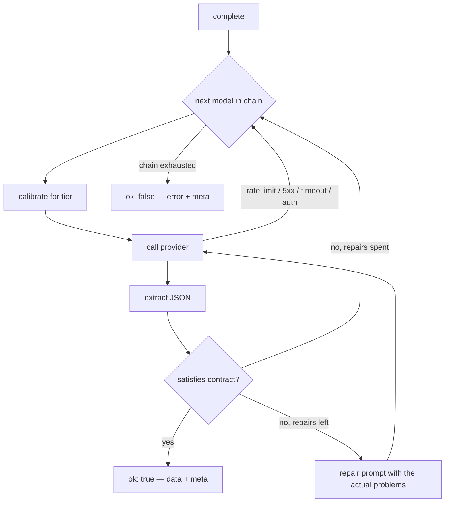

# llm-contract-router

[](https://github.com/ahmed-hashim-pro/llm-contract-router/actions/workflows/ci.yml) [](LICENSE)

Route across LLM providers behind one interface, and get output matching your
schema whichever model served it.

Falling back to a cheaper model is easy. Falling back *safely* is not: the
weaker model returns prose where JSON was asked for, or drops a required field,
and the failure surfaces in your application rather than in the router. This
library adapts each request to the target model's capability tier, validates the
answer against your schema, and gives the model one chance to fix it before
moving on — so a degraded answer is cheaper and slower, never malformed.

```
$ npm run example

answer   : { sentiment: 'positive', score: 0.91 }
served by: claude-haiku-4-5-20251001 (compact)
degraded : true
repairs  : 1
cost     : $0.000700

attempts:
  claude-opus-5 (frontier) repair=0: rate_limit
  claude-haiku-4-5-20251001 (compact) repair=0: contract — sentiment: must be positive, negative or neutral; score: must be a number between 0 and 1
  claude-haiku-4-5-20251001 (compact) repair=1: accepted
```

That runs against mock providers, so it needs no API key and no network.

## Quickstart

Node 22+.

```bash
git clone https://github.com/ahmed-hashim-pro/llm-contract-router.git
cd llm-contract-router

npm ci
npm run check     # build, typecheck, lint, 105 tests
npm run example   # the run above
```

## Usage

```ts
import { createRouter, fromSafeParser, models, withPricing } from "llm-contract-router";
import { createAnthropicProvider } from "llm-contract-router/anthropic";
import { z } from "zod";

const Sentiment = z.object({
  sentiment: z.enum(["positive", "negative", "neutral"]),
  score: z.number().min(0).max(1),
});

const router = createRouter({
  providers: {
    // BYOK: an explicit apiKey, or ANTHROPIC_API_KEY from the environment.
    anthropic: createAnthropicProvider(),
  },
  chain: [
    withPricing(models.anthropic.opus5,   { inputPerMTok: 15, outputPerMTok: 75 }),
    withPricing(models.anthropic.haiku45, { inputPerMTok: 1,  outputPerMTok: 5 }),
  ],
});

const result = await router.complete({
  prompt: "Classify the sentiment of: 'the food was genuinely wonderful'",
  // zod 4 generates the JSON Schema; on zod 3, pass your own object.
  contract: fromSafeParser("sentiment", z.toJSONSchema(Sentiment), Sentiment),
});

if (result.ok) {
  result.data.sentiment;        // typed, validated
  result.meta.degraded;         // did it come from the first choice?
  result.meta.costUsd;          // every attempt, summed
} else {
  result.error.kind;            // chain_exhausted | budget_exceeded | configuration
  result.meta.attempts;         // what was tried, and why each was rejected
}
```

## How it works



### Tier is the calibration

A model's tier decides how much scaffolding its request gets. This is the part
that makes degradation predictable:

| | `frontier` | `balanced` | `compact` |
| --- | --- | --- | --- |
| Schema in the prompt | yes | yes | yes |
| Explicit output rules | no | yes | yes |
| Worked example | no | no | yes |
| Temperature | 0.2 | 0.1 | 0 |

The asymmetry is deliberate. A compact model given a terse prompt returns prose
where JSON was asked for. A frontier model given all the hand-holding produces
*worse* output, because the scaffolding crowds out the actual task. The same
`complete()` call therefore does not produce the same request.

Override any tier without redefining the rest:

```ts
createRouter({ ..., calibration: { compact: { temperature: 0.3 } } })
```

### The contract is the guarantee

You supply anything with a `safeParse` — zod 3, zod 4, valibot, or a hand-written
function. On a validation failure the model is told **exactly which constraints
it broke**, then asked once more:

```
Your previous answer did not satisfy the schema.

You produced:
{"sentiment":"elated","score":7}

These constraints were not met:
- sentiment: must be positive, negative or neutral
- score: must be a number between 0 and 1

Return corrected JSON only.
```

Asking again without that just re-rolls the same mistake. If the repair also
fails, the router moves to the next model rather than spending more on one that
cannot comply.

Output is parsed tolerantly — markdown fences, prose either side, and braces
inside string literals are all handled — because instructing a model to return
only JSON does not make it so.

## Cost accounting, stated plainly

`meta.costUsd` is the sum across **every** attempt: repairs and abandoned models
included. A degraded path can therefore cost more than the primary would have.
That is a real tradeoff, not an oversight — you are buying a valid answer with
extra round trips.

If a ceiling matters more than an answer, set one:

```ts
createRouter({ ..., maxCostUsd: 0.05 })   // -> error.kind === "budget_exceeded"
```

### Prices are not shipped

`models` gives you model identities and tiers. It does **not** include prices,
because they change far more often than this package is released and a stale
number baked into a library is worse than no number — it reports a cost that
looks authoritative and is wrong. Tier is a judgement about capability that ages
much more slowly, so that is what ships. You supply pricing from your provider's
current page via `withPricing`.

## Testing your app

The mock provider is public API, not a test fixture, because the hard part of
testing an application built on a router is simulating a provider that
rate-limits or returns almost-valid JSON:

```ts
import { createMockProvider } from "llm-contract-router/testing";

const provider = createMockProvider("anthropic", [
  { fail: "rate_limit" },
  { text: '{"sentiment":"positive","score":0.9}' },
]);

provider.calls;   // every request the router sent, to assert against
```

`createHangingProvider` never answers, for exercising timeouts.

## Adding a provider

`Provider` is one method. Anything vendor-specific lives behind it, which is why
the core has no runtime dependencies:

```ts
const myProvider: Provider = {
  name: "my-provider",
  async complete({ model, system, prompt, temperature, maxOutputTokens, signal }) {
    // ...call your API...
    return { text, usage: { inputTokens, outputTokens } };
  },
};
```

Classify failures into the router's vocabulary — `rate_limit`, `unavailable`,
`timeout`, `auth`, `invalid_request` — by throwing `ProviderError`. That
classification is the adapter's job precisely so the routing logic never sees a
vendor error.

## Install footprint

The core has **zero runtime dependencies**. The bundled adapters use the official
SDKs, declared as *optional* peer dependencies behind subpath exports, so
installing this package pulls nothing and you add only the vendor you use:

```bash
git clone https://github.com/ahmed-hashim-pro/llm-contract-router.git
(cd llm-contract-router && npm ci && npm run build && npm pack)
npm i ./llm-contract-router/llm-contract-router-0.1.0.tgz   # installs exactly one package
npm i @anthropic-ai/sdk        # only if you import llm-contract-router/anthropic
```

It isn't published to npm yet, so the first two lines build it from source and pack it. Installing straight from GitHub (`npm i github:ahmed-hashim-pro/llm-contract-router`) doesn't work: `dist/` isn't committed, so the import fails.

Importing an adapter whose SDK is missing fails at import time with
`Cannot find package '@anthropic-ai/sdk'` — it names what to install rather than
failing later at request time. `llm-contract-router` and
`llm-contract-router/testing` need nothing.

Not even zod is a dependency — `Contract` is structural, which also means zod 3
and zod 4 both work despite not being source compatible.

## What this does not do

- **No streaming.** The contract is validated against a complete response;
  there is nothing to validate mid-stream.
- **No caching, no batching, no retries within a model** other than the single
  contract repair. A 429 falls over rather than backing off — if you want
  backoff, configure it on the provider's own client and pass it in.
- **No quality measurement.** The router trusts the tier you assign. It does not
  discover that a model got worse. (That is a different tool; see
  [noisefloor](https://github.com/ahmed-hashim-pro/noisefloor).)
- **Tier is a judgement, not a benchmark.** The shipped assignments are a
  starting point for your workload, not a ranking.

## Tests

105 tests. No API keys, no network, nothing to sign up for.

```bash
npm run check
```

CI sets no provider credentials at all, on Node 22 and 24 — the suite passing
there is the proof that every provider is mocked. The example is run in CI too,
verbatim, so the README's output cannot drift from what the code does.

## License

MIT — see [LICENSE](LICENSE).
